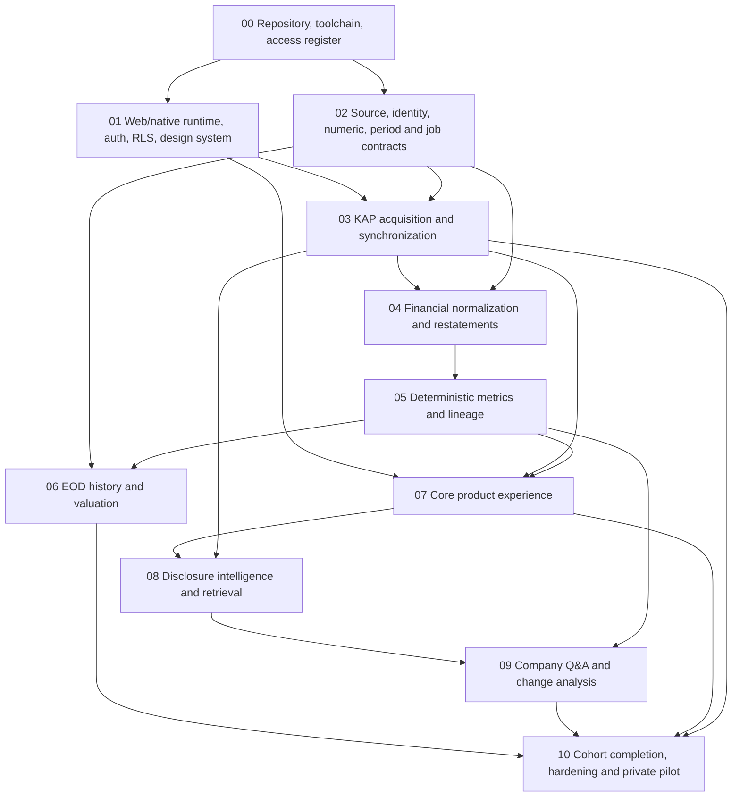

# Finpill — Canonical MVP Execution Plan

**Canonical roadmap:** `docs/MVP_EXECUTION_PLAN.md`  
**Status:** Approved implementation roadmap. Approval establishes direction and execution order; it does not mark tasks complete or architecture gates passed.  
**Baseline:** PROJECT_BLUEPRINT.md v0.3, repository instructions, previous architecture-readiness review, and the product-owner decisions recorded below.  
**Execution tracking:** [Task status and handoff](TASK_STATUS.md).  
**Correction tracking:** [Blueprint correction register](BLUEPRINT_CORRECTIONS.md).  
**Project instructions:** [Root AGENTS.md](../AGENTS.md).

## 1. Product boundary and architectural direction

### Confirmed product-owner decisions

- Ship a fully functional **private pilot on web, iOS, and Android**.
- Use **one statically bundled Next.js client**, shared across platforms, and a **separate Next.js server/API deployment**.
- Make the full eligible BIST company directory searchable.
- Approved research-navigation revision (2026-09-23, BC-18): three primary destinations (Ana Sayfa, İzleme, Daha Fazla), persistent global search, and company-context analysis/Q&A. Preserve company Q&A and private conversations in MVP. The mockup is illustrative; blueprint v0.4 governs periods, provenance, freshness and accessibility. Existing phase order, dependencies and architecture gates remain unchanged.
- Require **20 deliberately selected companies × 12 financial quarters** for historical validation and backfill completion.
- Keep ingestion, identifiers, schemas, and processing full-market capable. The cohort is a validation and initial coverage boundary, not a hard-coded platform limit.
- Defer public launch, public data redistribution approval, billing, public store publication, push notifications, and late native polish. These deferrals must not require replacement of the underlying architecture.

Retain all agreed MVP capabilities: financial ingestion, historical statements, deterministic metrics, EOD valuation, company search, watchlist, disclosure timeline, AI extraction, company Q&A, “what changed” analysis, source drill-down, freshness, and operational recovery.

Continue excluding trading, brokerage integration, technical analysis, real-time prices, public social features, advanced backtesting, scoring, and separate Python/vector services. ROE/ROA/ROIC remain later capabilities as specified in blueprint §14; their appearance in example screens does not expand this MVP.

### Repository state at roadmap adoption

Before task 00.01, the repository contained the blueprint and `docs/agents.md`. There was no Git repository, application scaffold, dependency manifest, migration, fixture, test suite, or deployment configuration. The rules file was RTF despite its `.md` extension; there was no root `AGENTS.md`.

The roadmap therefore begins with documentation and repository foundations. Live implementation state is tracked in [TASK_STATUS.md](TASK_STATUS.md); nothing below is assumed implemented merely because it is planned.

### Target architecture

| Area | Decision |
|---|---|
| Repository | Small npm workspace: client application, API application, and shared contracts. Keep domain and integration modules server-side. No additional build orchestrator initially. |
| Client | Next.js static export containing one shared React application. Use a client-side route registry for the blueprint’s URLs rather than generating a page for every ticker at build time. |
| Routing | React Router with browser history on web and an equivalent native history adapter over the same route definitions. Native deep links resolve canonical web URLs into internal routes. |
| Server | Separate Next.js App Router API application on Vercel, running domain services and bounded job handlers in the Node.js runtime. |
| Mobile | Capacitor bundles the exported client assets. No production `server.url`, embedded Next.js server, server-secret-bearing assets, or dependence on development live reload. |
| Authentication | Clerk web SDK for web; narrow Capacitor adapters around official Clerk iOS/Android SDKs for native session handling. Prove this integration early. Default pilot sign-in uses invited email identities and verification codes. |
| Authorization | Every protected API verifies Clerk tokens. User-owned database operations forward the verified Clerk identity through Supabase’s third-party authentication integration and RLS. |
| Data | Supabase PostgreSQL and private Storage; append-only sources and financial outputs; mutable operational state and current-version pointers kept separate. |
| Processing | Supabase Cron dispatches authenticated, bounded Vercel job runs. PostgreSQL owns jobs, claims, leases, checkpoints, retries, and deduplication. |
| AI | Vercel AI SDK/Gateway, PostgreSQL generation records, and pgvector for narrative retrieval. Financial arithmetic remains deterministic. |
| Deployments | Separate client/API deployment targets, coordinated releases, isolated local/staging/pilot configuration, and backward-compatible APIs for installed native clients. |

Next.js documents static SPA deployment, while request-time server features require a server runtime. This supports the selected client/API split. Capacitor expects compiled web assets; the native authentication adapters remain an explicit implementation gate rather than an assumed off-the-shelf integration. [Next.js SPA migration guidance](https://nextjs.org/docs/app/guides/migrating/from-vite), [Capacitor configuration](https://capacitorjs.com/docs/config), [Clerk iOS SDK](https://clerk.com/docs/ios/getting-started/quickstart), [Clerk Android SDK](https://clerk.com/docs/android/getting-started/quickstart).

## 2. Cross-cutting contracts and architecture gates

These contracts must be recorded before dependent tasks proceed. An ADR is accepted only when its required evidence exists.

### Architecture gates

| ADR | Decision and required evidence | Must precede |
|---|---|---|
| **A01 — Web/native runtime** | Shared static client, API separation, routing adapters, asset loading, native navigation, deep links, and client/API compatibility. Release-mode builds must work without a development server. | Product screen implementation beyond the foundation shell. |
| **A02 — Identity and authorization** | Clerk SDK adapters; verified bearer-token API access; text Clerk subject IDs; Supabase JWT integration; RLS; private-pilot eligibility; separate machine/admin authority. | Watchlists, preferences, conversations, and privileged operations. |
| **A03 — Environments and releases** | Public/server configuration boundaries, deployment origins, native application IDs, signing ownership, secrets, preview isolation, and installed-client compatibility. | Staging/native integration and pilot deployment. |
| **A04 — Issuer/security identity** | Stable issuer and security IDs, KAP mappings, effective-dated ticker/ISIN aliases, disclosure associations, and security-level prices. | Directory, disclosure, financial, and market migrations. |
| **A05 — Immutable source revisions** | Logical source identity, representation/subreport scope, exact payload storage, acquisition records, hashes, revisions, and append-only enforcement. | Persistent ingestion. |
| **A06 — Exact numbers** | Lossless parsing, decimal strings, PostgreSQL numeric storage, `decimal.js`, rounding, formatting, and chart-only approximations. | Fact normalization and any financial computation. |
| **A07 — Financial identity and compatibility** | Context dimensions, reporting scope, fiscal dates, accounting basis, restatement/TMS 29 basis, as-of selection, and publication rules. | Financial schema and quarter/TTM implementation. |
| **A08 — Jobs and recovery** | At-least-once execution, atomic claiming, fencing/leases, retries, checkpoints, transactional dispatch, source-wide rate limits, and external-call uncertainty. | Unattended synchronization. |
| **A09 — Metric methodologies** | Taxonomy mappings, applicability, quarter/TTM/growth rules, EBITDA, net debt, capex/FCF, denominators, tolerances, and methodology versioning. | Publishing calculated metrics. |
| **A10 — Market data and valuation** | Selected provider, permitted pilot use, coverage, historical prices/share counts, corporate actions, availability timestamps, share classes, and valuation formulas. | EOD adapter implementation and valuation publication. |
| **A11 — AI evidence and generations** | Model evaluation, prompt/schema versions, citations, numeric grounding, generation persistence, budgets, and failure behavior. | AI outputs visible to users. |
| **A12 — Embedding infrastructure** | Model and dimensions, text/chunk versions, retrieval evaluation, index isolation, and re-embedding/cutover procedure. | Persistent embeddings. |

The recommended Clerk integration is Supabase’s native third-party authentication support, not the deprecated shared-secret JWT-template approach. [Supabase Clerk integration](https://supabase.com/docs/guides/auth/third-party/clerk).

### Required data invariants

1. **Source identity and immutability**
   - Separate logical disclosures from append-only source versions and fetch observations.
   - Source identity includes provider/environment, endpoint, external identifier, requested representation, and subreport scope.
   - Retain exact response bytes and raw hash. Canonicalized hashes are separate, versioned processing aids.
   - Repeated identical responses can reference the same immutable version while retaining acquisition observations.
   - Changed content creates a new version. It never overwrites the previous payload.

2. **Financial identity**
   - Facts reference an explicit financial context, filing/source revision, and parser build.
   - Context identity includes source scope, entity, dimensions, actual dates, and consolidation where applicable.
   - Reprocessing the same source with a new parser creates a new processing build.
   - Comparative restatements in a later filing do not erase the originally reported values.
   - Publish complete validated generations atomically; a failed generation cannot replace the previous valid generation.

3. **Exact numbers**
   - Authoritative values cross JSON/API boundaries as decimal strings.
   - Parse source number tokens losslessly before they can become JavaScript floating-point values.
   - Preserve lexical raw values, units, scale, and source rounding metadata.
   - Do not silently round source facts to fit `numeric(38,6)`.
   - Approximate JavaScript numbers are allowed only at the final chart-rendering boundary, with exact values retained for labels and drill-down.

4. **Period and restatement compatibility**
   - Prefer direct reported standalone periods.
   - Derive quarters only from compatible cumulative periods with matching fiscal starts and genuinely nested source dates.
   - Require consistent entity, scope, currency/unit, accounting basis, and restatement purchasing-power basis.
   - TTM requires a complete, compatible period coverage set without gaps or overlaps.
   - Do not invent TMS 29 rebasing factors or splice independently “latest” facts into an incompatible series.
   - Unsupported comparisons return an explicit reason, not a guessed value.
   - Support original/as-of and latest-compatible selection internally; a user-facing toggle remains optional.

5. **Execution semantics**
   - Metadata insertion, downstream-job creation, and cursor advancement form one database transaction.
   - Network calls occur outside database transactions.
   - Workers use atomic claims, expiring leases, and fencing so an expired worker cannot publish after ownership changes.
   - Job identities include source revision/fingerprint and applicable processing versions.
   - Duplicate database outputs must be prevented. Exactly-once external AI billing is not promised without provider support; uncertain outcomes are recorded and reconciled.

6. **Public interfaces**
   - Version the client API from the beginning, using `/api/v1`.
   - Share runtime-validated DTOs, not database rows or raw KAP taxonomy.
   - Numeric results include value/status, units, period/basis, methodology, lineage reference, and generation identity.
   - Distinguish missing, incompatible, not meaningful, and not applicable.
   - Freshness distinguishes source publication, acquisition, processing, last successful check, and expected update.
   - Private responses are not globally cached. Client caches are cleared or partitioned on identity changes.

## 3. Global dependency graph

Phase numbers organize work; they do not require serial execution of every phase. The phase graph summarizes the architecture; task dependency rows are authoritative for task readiness.

The platform and data-contract tracks can overlap. Market-provider qualification begins early; market ingestion can proceed while financial parsing is built. AI implementation waits for deterministic financial data and the core source-traceable UI.

### Task conventions

There are **80 tasks**. IDs are permanent, even if future amendments reorder execution.

Dependencies listed below are direct dependencies; their prerequisites are inherited.

Every code task includes lint, typecheck, relevant tests, and review. Additional test labels:

- **U:** unit/property tests.
- **I:** database/service integration tests.
- **C:** API/provider contract tests.
- **E:** browser end-to-end tests.
- **N:** native iOS/Android tests.
- **G:** independently verified financial golden tests.
- **F:** concurrency, failure-injection, and recovery tests.
- **S:** security/authorization tests.
- **D:** documentation/evidence review.

## 4. Phase-by-phase execution

### Phase 00 — Repository, toolchain, and prerequisite register

**Goal:** Create a reproducible, governed repository without building product features.

**Why now:** Worktrees, CI, migrations, and all later implementation depend on a stable repository and explicit ownership of external prerequisites.

| ID | Dependencies | Deliverables | Acceptance criteria and required tests |
|---|---|---|---|
| **00.01** | None | Canonical roadmap; plain UTF-8 root instructions; correction register; task-status convention. | Preserve existing financial and Context7 rules. Replace the RTF rules duplicate with a canonical pointer. Record roadmap precedence for execution order without silently changing product scope. **D:** verify document consistency. |
| **00.02** | 00.01 | Git/GitHub setup, branch/PR conventions, Node/npm pins, ignore rules. | Confirm repository owner/destination. Use Node 24 LTS, npm 11, exact compatible patches, and one lockfile. Secrets and generated assets are excluded. **D:** fresh-clone procedure reviewed. |
| **00.03** | 00.02 | Client/API/contracts npm workspace; strict TypeScript; lint, formatting, unit-test and build commands. | Both application targets build independently. Import rules prohibit server modules in the client. **U:** boundary checks; clean-install build smoke. |
| **00.04** | 00.03 | Zod environment schemas and environment matrix. | Separate build-time public settings from server secrets. Validate API origins and feature-specific requirements. No production fallback to development services. **U/S:** malformed/missing settings and secret-bundle checks. |
| **00.05** | 00.03 | Local Supabase/container setup, migration workflow, disposable test database, initial CI. | Fresh database replay succeeds; tests never target pilot data. CI runs frozen installation and required checks. **I:** clean migration replay and database connectivity. |
| **00.06** | 00.01 | Access register for GitHub, Supabase, Clerk, Vercel, KAP, market providers, domains, native signing, and fixtures. | Each prerequisite has an owner, environment, status, and consuming task. Record rights evidence without secrets. Missing access blocks only its dependent task. **D:** no prerequisite is implicitly assumed available. |

**ADRs:** Draft A01–A03.  
**Exit gate:** Reproducible repository and CI; external prerequisites have owners and explicit gates.  
**Safe parallel worktrees:** 00.04 and 00.05 after 00.03; 00.06 can run alongside bootstrap.

---

### Phase 01 — Production web/native foundation, authentication, and design system

**Goal:** Prove the actual delivery architecture on all three platforms before product UI depends on it.

**Why now:** Asset delivery, routing, authentication, secrets, and authorization cannot safely be retrofitted after screens and user-specific features exist.

**Private-use mobile path:** The owner is installing and testing the app personally, with no near-term App Store or Google Play publication. Task 01.02 may use local Xcode/Personal Team development signing and Android development/debug signing where needed. Apple Developer Program enrollment, App Store Connect, Google Play Console, production certificates and production keystore custody are not prerequisites for 01.02 unless its actual acceptance test technically needs them. The bundled-asset, release-mode configuration, cold-start and artifact checks below still apply. Reassess production signing/store ownership only when a later distribution method requires it; store publication remains a separate release gate. The confirmed app IDs and deferred prerequisites are in [ACCESS_REGISTER.md](ACCESS_REGISTER.md).

| ID | Dependencies | Deliverables | Acceptance criteria and required tests |
|---|---|---|---|
| **01.01** | 00.03, 00.04 | Static client entry, shared route registry, API transport, `AuthPort` and platform interfaces. | Canonical blueprint URLs work without enumerating tickers at build time. API errors and token acquisition are centralized. **C/E:** arbitrary ticker route, refresh, unknown route, transport failure. |
| **01.02** | 01.01, 00.06 | Capacitor iOS/Android projects and release-mode asset/build configuration. | Both shells load bundled assets without a development server. No server secrets, remote executable app shell, or `.next` server output is packaged. **N/S:** cold start, asset loading, artifact inspection. |
| **01.03** | 01.01, 00.06 | Clerk web authentication and server bearer-token verification. | Invited users can sign in/out; unsigned, expired, wrong-issuer, and otherwise invalid tokens fail. Protected APIs do not rely on route hiding. **E/C/S:** session and invitation cases. |
| **01.04** | 01.02, 01.03 | iOS Clerk SDK adapter behind `AuthPort`. | Sign-in, token refresh, cancellation, resume, and sign-out work in a release-mode shell. Persistent session material stays in SDK-supported secure storage. **N/S:** cold restart, expiry, network loss, token leakage checks. |
| **01.05** | 01.02, 01.03 | Android Clerk SDK adapter behind the same interface. | Same contract as iOS, including process recreation and background/resume. No handwritten browser-cookie workaround. **N/S:** lifecycle, expiry, cancellation, secure persistence. |
| **01.06** | 01.03, 00.05 | Clerk/Supabase integration, minimal profiles, pilot eligibility, RLS and user-scoped database client. | A cannot access or modify B’s rows; anonymous/uninvited access fails directly through the Data API as well as through the API application. User requests never use service-role authority. **I/S:** ownership, reassignment, token and eligibility tests. |
| **01.07** | 01.02, 01.03 | Universal/App Link configuration and shared navigation adapter. | Cold/warm company/tab and search/analysis detail links, sign-in return paths, browser back, and Android back work. Legacy `/ai` replaces to `/search` without guessing company context or creating a redirect loop. Untrusted hosts and redirect targets are rejected. **E/N/S:** deep links, malformed URLs, interrupted auth. |
| **01.08** | 01.01 | Turkish design tokens, light/dark/system themes, typography, shell navigation and reusable state primitives. | Three primary destinations (Ana Sayfa, İzleme, Daha Fazla) and equivalent desktop navigation match blueprint v0.4. Persistent search entry, desktop keyboard access, detail-page return/focus behavior and legacy `/ai` compatibility work without a global AI tab. Company detail must not be identified as the Home page. Real directory results remain 07.01 scope. Safe areas, focus, contrast, reduced motion, and loading/empty/error/stale primitives work. **E/N:** responsive and accessibility checks, narrow-screen labels/secondary-text contrast, and web/iOS/Android shell navigation. Existing five-destination evidence does not satisfy the revised acceptance. |
| **01.09** | 00.05, 00.06, 01.01, 01.02 | Client/API Vercel previews, staging origins, native build pipeline and release metadata. | Builds use the intended environment; preview credentials cannot reach pilot resources. Native builds consume a versioned API. **C/N/S:** deployed health, origin/CORS, build-profile and secret checks. |
| **01.10** | 01.04–01.09 | Integrated platform proof and accepted foundation ADRs. | On web/iOS/Android: invited sign-in → protected API → RLS-controlled row → deep-link navigation → sign-out. Test production-style Clerk configuration, not only development keys. **E/N/I/S:** full flow and identity-switch cache isolation. |

**ADRs:** Accept A01–A03. A failed native authentication proof blocks dependent UI; it cannot be deferred to final hardening.  
**Exit gate:** Authenticated, authorized, production-style web/native shells are demonstrated.  
**Safe parallel worktrees:** iOS and Android adapters after shared interfaces merge; design-system work alongside authentication; deployment work alongside platform adapters. One owner controls shared auth contracts.

---

### Phase 02 — Source identity, financial contracts, and recoverable execution

**Goal:** Define and enforce the foundations on which ingestion and calculations depend.

**Why now:** Immutable source identity, financial basis, and execution semantics determine schema correctness. Market-provider discovery starts here to expose access and historical-data gaps early.

| ID | Dependencies | Deliverables | Acceptance criteria and required tests |
|---|---|---|---|
| **02.01** | 00.06 | Real source evidence pack, fixture manifest, and deliberate 20-company cohort selection. | Cover materially different statement structures, fiscal calendars, consolidation, restatements/TMS 29, dimensional facts, missing/negative values, and cardinality variants. Include financial-sector structures where available. Fixtures record origin, retrieval time, hash, rights, and independently checked expectations. **D/G:** coverage review. |
| **02.02** | 02.01, 00.05 | Issuer/security schema and effective-dated external-identifier mappings. | Model multiple securities per issuer, ticker changes, relevant disclosure associations, and unresolved identities without guessing. Prices belong to securities. **I/C:** uniqueness, interval overlap, ticker reuse, issuer/security joins. |
| **02.03** | 02.02, 00.04 | Immutable raw-source tables, private object storage, acquisition records and hashing. | Exact payloads survive parsing failures. Identical retries deduplicate; changed bodies append revisions. Representation/subreport variants cannot collide. **I/F/S:** concurrent writes, rejected overwrite, interrupted upload and recovery. |
| **02.04** | 00.03, 00.05, 02.01 | Exact decimal utilities, lossless JSON handling, numeric DTOs, formatting policy. | Large integers and fractional values round-trip without loss; invalid/overflow inputs fail explicitly. UI formatting does not mutate authoritative values. **U/I/G:** precision, sign, scale, locale, database round-trip. |
| **02.05** | 02.01, 02.02, 02.04 | Financial context/fact identity, compatibility, selection, and publication contracts. | Define fiscal coverage, dimensions, scope, restatement basis, knowledge time, and explicit unsupported states before financial migrations. **D/U:** decision tables for compatible/incompatible fixtures. |
| **02.06** | 02.03, 00.05 | Job schema, atomic enqueue/claim/lease/complete operations and deduplication keys. | Concurrent workers cannot publish duplicate results; expired ownership cannot commit; retries preserve history. Include attempt timestamps and terminal failure states. **I/F:** lease expiry, fencing, duplicate enqueue, crash recovery. |
| **02.07** | 02.06, 01.09 | Bounded Vercel runner, Supabase Cron dispatch, machine authentication, shared rate budgets and structured logs. | No detached untracked processing. Runner exits within configured platform limits; work resumes from durable state. Machine routes reject user-only credentials. **C/F/S:** timeout, replay, overload, redaction and scheduler failure. |
| **02.08** | 00.06, 02.02 | Market-provider evaluation and pilot-use decision; price/share/corporate-action evidence. | Select a provider only after demonstrating historical coverage, identifier mapping, adjustment semantics, and permitted pilot storage/display. Record public redistribution as a later gate. **D/C:** sample comparison and coverage evidence. |

**ADRs:** Accept A04–A08; accept provider/access portion of A10.  
**Exit gate:** Source, identity, numeric, compatibility, and execution contracts are stable. Market-provider gaps have an explicit disposition before adapter implementation.  
**Safe parallel worktrees:** Decimal utilities and source storage after identity contracts; provider evaluation alongside queue implementation. Serialize migrations that touch shared contracts.

---

### Phase 03 — KAP acquisition and change-driven synchronization

**Goal:** Reliably discover disclosures and retain authoritative source responses.

**Why now:** Parsing must consume durable sources; live synchronization must already be resumable and observable.

| ID | Dependencies | Deliverables | Acceptance criteria and required tests |
|---|---|---|---|
| **03.01** | 02.01, 02.03, 02.07 | KAP auth adapter, HTTP transport, runtime schemas, timeout/retry/rate-limit handling. | Basic development auth works; production auth is implemented only against validated documentation/account evidence. Preserve KAP-specific errors; never convert failures into empty results. **C/U/F:** 429, token refresh, timeout, malformed envelopes, redaction. |
| **03.02** | 03.01, 02.02 | `/members` and `/memberSecurities` ingestion and directory synchronization. | Full eligible BIST directory is persisted with provenance and stable mappings; ambiguous mappings are flagged. **C/I:** repeat sync, deactivation, ticker change, multiple securities and member-type filtering. |
| **03.03** | 03.01, 03.02, 02.06 | Disclosure cursor discovery and transactional metadata/job persistence. | Validate actual pagination direction, inclusivity and gaps. Persist each page and its jobs before checkpoint advancement. Unchanged cursor performs no detail/parser/AI work. **C/I/F:** >50 items, overlaps, gaps, page failure and concurrent pollers. |
| **03.04** | 03.03, 02.03 | Disclosure-detail and required attachment acquisition. | Real FR/non-FR responses become immutable revisions. Attachment failure does not discard usable structured data. Outbound URLs, sizes and types are constrained. **C/I/S:** representation variants, changed content, interrupted download, unsafe URLs. |
| **03.05** | 03.04, 02.07 | Bounded backfill, explicit reprocessing and correction reconciliation. | Backfill has independent checkpoints and cannot starve live sync. Verify whether same-index corrections occur; use the validated correction mechanism or bounded reconciliation. **F/C:** resume, pause, restart, rate budget and same-index mutation. |
| **03.06** | 03.03, 02.07, 01.06 | Initial operator commands for cursor/status, failed jobs, retry, reprocess and bounded backfill. | Routine recovery requires no manual database edits. Commands enforce operator authority and retain audit records. **I/S/F:** unauthorized commands and safe repeated recovery. |
| **03.07** | 03.05, 03.06 | Unattended staging synchronization proof. | Scheduled discovery → persisted source → completed acquisition jobs survives restart, duplicate triggers and provider outage. Parser/AI handlers remain disabled until implemented. **F/I:** replay tests plus controlled live-source evidence. |

**ADRs:** Finalize KAP details in A05/A08.  
**Exit gate:** A real disclosure is durably persisted, and automated acquisition recovers without lost checkpoints.  
**Safe parallel worktrees:** Operator commands can proceed alongside detail/backfill work after queue contracts merge. Provider rate-budget changes have one owner.

---

### Phase 04 — Financial normalization, filing versions, and quality

**Goal:** Turn real FR revisions into auditable, validated financial facts.

**Why now:** Metrics require stable facts with explicit contexts and compatible revision-selection rules.

| ID | Dependencies | Deliverables | Acceptance criteria and required tests |
|---|---|---|---|
| **04.01** | 02.03, 02.05, 03.04 | Filing, parser-build, context, fact and validation migrations. | Explicit source/context/build foreign keys and uniqueness constraints; original source facts cannot be overwritten. **I:** constraint failures, clean replay, parser-version coexistence. |
| **04.02** | 04.01 | Context normalization. | Parse instant/duration dates, entities, dimensions and scope; normalize cardinality; reject contradictory or unresolved contexts. No quarter inference from labels. **U/G:** singleton/array, non-calendar year, dimensional and malformed contexts. |
| **04.03** | 04.01, 02.04 | Recursive report-tree extraction, statement detection, labels and presentation metadata. | Preserve raw sign, `preferredLabel`, source concept, hierarchy, units and precision. Statement identification uses role plus taxonomy evidence. **U/G:** object/array variants, repeated concepts, nil/zero, large numbers and unknown statement types. |
| **04.04** | 04.02, 04.03 | Transactional normalized-fact persistence and processing builds. | Retrying an identical build creates no duplicate facts; failures cannot expose partial datasets. **I/F:** injected failure mid-write, retries and concurrent reprocessing. |
| **04.05** | 04.04, 02.05 | Filing succession, comparative-restatement selection and publication pointers. | Preserve original/as-of history and select latest compatible facts. Later comparative revisions are handled independently from the later filing’s primary period. **G/I:** restatements, late arrivals, TMS 29 basis differences and failed replacement builds. |
| **04.06** | 04.05, 02.01 | Financial quality checks and expanded golden fixture suite. | Validate balance-sheet reconciliation using documented source-aware tolerances, duplicates, units and required inputs by report type. Warnings never silently repair data. **G/U:** all validated TSPOR fields plus structurally different issuers. |
| **04.07** | 04.06, 03.07 | Automated FR acquisition → parse → validation → publication graph. | A new valid FR publishes facts; invalid replacements retain the prior valid generation and expose processing failure. Reprocessing is versioned and recoverable. **I/F/G:** full pipeline and restart scenarios. |

**ADRs:** Accept final A07 normalization/restatement policy.  
**Exit gate:** Real FRs from materially different structures normalize reproducibly, retain source identity, and pass independent assertions.  
**Safe parallel worktrees:** Context parser and tree extractor after 04.01. Golden expectations can be independently reviewed alongside implementation, but must not be generated from the parser being tested.

---

### Phase 05 — Deterministic metrics, methodology, and lineage

**Goal:** Publish trustworthy historical financial metrics with complete calculation ancestry.

**Why now:** Product views, valuation, and numeric AI questions must all consume the same tested deterministic outputs.

| ID | Dependencies | Deliverables | Acceptance criteria and required tests |
|---|---|---|---|
| **05.01** | 04.06, 02.04 | Versioned taxonomy mappings, applicability matrix and methodology specifications. | Cover blueprint core metrics; distinguish sector-inapplicable metrics from missing mappings. Resolve sign rules, EBITDA input eligibility, debt components and cash-flow definitions with cross-issuer evidence. **D/G:** independently reviewed formulas and expected examples. |
| **05.02** | 04.05, 05.01 | Compatible period selection and standalone-quarter derivation. | Prefer reported quarters; subtract only compatible cumulative periods; honor fiscal dates and reject gaps/basis conflicts. **U/G:** Q1–Q4, non-calendar years, restatements and missing predecessors. |
| **05.03** | 05.01 | Income-statement, balance-sheet and cash-flow metric definitions. | Exact reported/mapped metrics, operating/investing/financing cash flow, capex and FCF retain input lineage. No absent value becomes zero. **U/G:** sign, component inclusion, zero/missing and sector applicability. |
| **05.04** | 05.02, 05.03 | TTM, YoY/QoQ and margin engine. | Require compatible complete coverage; define zero/negative-base growth behavior explicitly. Do not sum balance-sheet instants. **U/G:** gaps, overlaps, basis mismatch, zero denominators, negative bases and annual boundaries. |
| **05.05** | 05.04 | EBITDA, net debt and balance-sheet/liquidity ratio implementations. | No double-counting debt subtotals or unsupported D&A add-backs. Candidate EBITDA is published only when validated inputs qualify. Lease/investment treatment is explicit and versioned. **G/U:** cross-issuer references and unavailable-input cases. |
| **05.06** | 05.05, 04.07 | Metric generations, lineage DAG, invalidation, atomic publication and read services. | Every output resolves to facts/source revisions and formula/mapping versions. Restatements recompute affected outputs without rewriting old generations. **I/F/C:** repeatability, dependency invalidation, atomic publication and DTO precision. |
| **05.07** | 05.06 | Independent deterministic-pipeline acceptance suite. | Reported values match fixtures exactly; derived values meet explicit formula-specific tolerances. No unresolved discrepancies in the accepted benchmark set. **G/I:** replay from raw source through final DTO and source traversal. |

**ADRs:** Accept A09. Net-debt and EBITDA decisions cannot remain TODOs when outputs are published.  
**Exit gate:** Deterministic metrics and complete lineage are independently validated.  
**Safe parallel worktrees:** Base metric definitions and period selection after 05.01; independent golden review alongside both. One owner controls publication and invalidation contracts.

---

### Phase 06 — EOD history, corporate actions, and valuation

**Goal:** Deliver historically correct security prices and valuation metrics.

**Why here:** Acquisition can begin after source/provider foundations; valuation waits for financial methodology and as-of selection.

| ID | Dependencies | Deliverables | Acceptance criteria and required tests |
|---|---|---|---|
| **06.01** | 02.08, 02.03, 02.07 | EOD provider adapter, immutable observations and exchange-calendar handling. | Ingest security-keyed prices with source timestamps and explicit adjusted/unadjusted semantics. Holidays and missing closes are distinguishable. **C/I:** duplicate/corrected bars, symbol mapping and unavailable data. |
| **06.02** | 06.01, 02.02 | Historical share counts, capital changes and corporate-action provenance. | Effective dates and knowledge times are retained; current capital is not retroactively applied to history. Share capital is not assumed to equal share count. **G/I:** splits, capital changes, treasury shares and share-class coverage. |
| **06.03** | 06.02, 04.05, 05.07 | Point-in-time financial/price/share joins and valuation methodology. | Historical calculations exclude filings unavailable on the valuation date. Consolidation, parent attribution, currency and share-class rules are explicit. **G/U:** future-filing exclusion, restatements and insufficient inputs. |
| **06.04** | 06.03, 05.05 | Market cap, enterprise value, P/E, P/B, EV/EBITDA and price/sales where applicable. | Version formulas and all price/share/financial inputs. P/E with nonpositive earnings is N/M; other denominator rules are documented. **G:** independent reference calculations. |
| **06.05** | 06.04, 03.07 | Scheduled EOD and correction-triggered valuation refresh. | Price-only changes recalculate valuation without reparsing statements or regenerating fundamental narratives. **I/F:** holidays, corrections, outages, repeated jobs and trigger isolation. |
| **06.06** | 06.05 | Historical valuation read contracts and acceptance evidence. | Return valuation provenance, source dates, valid/unsupported states and EOD freshness. Historical windows align with supported financial history. **C/G/I:** precision, coverage and stale/absent feed behavior. |

**ADRs:** Complete A10 before publication.  
**Exit gate:** Historical valuations reproduce approved references without look-ahead or share-count substitution.  
**Safe parallel worktrees:** 06.01–06.02 can overlap financial normalization/metrics. This phase can finish alongside core UI and AI work.

---

### Phase 07 — Complete deterministic product experience

**Goal:** Make financial research usable across web and native before introducing AI interpretation.

**Why now:** Stable normalized contracts prevent taxonomy logic and calculations from leaking into components.

| ID | Dependencies | Deliverables | Acceptance criteria and required tests |
|---|---|---|---|
| **07.01** | 01.10, 03.02 | Company/search APIs, desktop search dropdown and addressable mobile/desktop search view, company header/return navigation and four local tabs. | Full-directory ticker/legal-name/normalized-name search works. Stable IDs drive data access; ticker aliases resolve safely. Unsupported historical coverage is explicit. **C/E/N:** Turkish search, aliases, recent searches, loading/empty/error states, keyboard/focus restoration, direct links/back behavior, long names and narrow-screen tabs. |
| **07.02** | 01.06, 02.02, 01.10 | Default watchlist, preferences and last-viewed state APIs/RLS. | One default watchlist per user; idempotent add/remove; ownership and private caching enforced. **I/S/C:** cross-user access, concurrent writes and identity switches. |
| **07.03** | 01.10, 05.06 | Source/lineage API and shared drawer/sheet. | Traverse metric → formula → inputs → reported fact → exact source revision. Show exact value, dates, units and methodology. **E/N/C:** multi-level lineage, missing reference failure, keyboard/focus behavior. |
| **07.04** | 07.01, 07.03, 04.07 | Financial statements UI. | Income, balance sheet and cash-flow tables support applicable quarter/annual/cumulative modes, source rows, restatement labels and accessible narrow-screen scrolling. **E/N/G:** displayed values match API fixtures; all data states. |
| **07.05** | 07.01, 07.03, 05.07 | Company overview and key financial trend modules. | Place What Changed before key metrics, then trends, valuation and disclosures. Display real metrics with explicit source-derived periods, comparison bases and source access; expose independent financial/source freshness. Reserve company-context analysis/question actions for available AI functionality. AI/valuation absence is an honest module state. No client arithmetic or upstream KAP fetch occurs. **E/N/C:** module isolation and network assertions. |
| **07.06** | 07.03, 05.07 | Ratio groups and historical financial charts. | Units, neutral/semantic change colors, exact tooltips, N/M explanations and table alternatives are consistent. Distinguish standalone/cumulative/annual/TTM bases and actual source dates; no misleading annual-versus-partial-period trends. Reject incompatible comparisons, including unsupported TMS 29 bases; margin deltas use percentage points. **E/N/G:** negative values, gaps, incompatible series and accessibility. |
| **07.07** | 07.02, 07.05, 03.07 | Watchlist UI, home changes, settings and raw KAP timeline. | New-information markers use last-viewed state. Theme/account/data-source settings work. Raw disclosures are navigable before AI enrichment. **E/N/S:** private state, filters, loading/error/stale states. |
| **07.08** | 07.04–07.07 | Core product integration gate. | All three primary destinations, persistent search and four company tabs are reachable; detail location, focus/return behavior and compatibility routes are correct; browser/native navigation and source drill-down work against real processed data. **E/N:** end-to-end research journey, failure isolation and responsive checks. |

**ADRs:** Conform to A01/A02/A06/A07; no alternate routing or presentation data model.  
**Exit gate:** A user can research a company and audit its financial values on all three platforms without AI.  
**Safe parallel worktrees:** Search and watchlist data work after the platform gate; statements, overview and ratios after the source/DTO contracts merge. Shared shell and primitives remain single-owner interfaces.

---

### Phase 08 — Disclosure intelligence and evidence retrieval

**Goal:** Produce source-grounded corporate events and searchable official narrative evidence.

**Why now:** The deterministic pipeline and source UI are stable; AI can now consume reliable evidence without becoming a financial authority.

| ID | Dependencies | Deliverables | Acceptance criteria and required tests |
|---|---|---|---|
| **08.01** | 07.08, 05.07 | AI evaluation set, model selection, Gateway configuration, generation contract and budgets. | Select models using representative Turkish disclosures/questions and current supported APIs. Record model/prompt/schema versions and per-user/job limits. **D/C:** approved evaluation protocol and provider failure cases. |
| **08.02** | 08.01, 03.04 | Versioned narrative-text extraction and attachment processing. | Preserve source revision, page/section/offset provenance. Prefer structured text; bound attachment parsing and explicitly flag unsupported documents. **U/I/S:** malformed files, extraction failure, unsafe content and reproducibility. |
| **08.03** | 08.02, 02.06 | AI generation ledger and structured event extraction jobs. | Persist request identity before execution and retain result/model/usage. Extracted amounts are decimal strings with supporting text spans and remain interpretations. **C/I/F:** invalid JSON, unsupported claims, duplicate jobs and ambiguous provider outcomes. |
| **08.04** | 08.03, 07.01 | Event APIs and enriched KAP/event timeline. | Classifications/summaries link to original disclosures and source revisions; failed AI enrichment leaves raw disclosures usable. **E/N/C:** filters, corrections, mixed raw/processed states and safe rendering. |
| **08.05** | 08.02, 08.01 | Versioned narrative chunks and pgvector embedding pipeline. | Freeze model/dimensions/chunk policy after retrieval evaluation. Embed narrative text only; never use embeddings as the source of financial metrics. Re-embedding builds a separate index generation. **I/C/F:** deduplication, model mismatch and cutover. |
| **08.06** | 08.05, 08.03, 05.06 | Company/date/type-filtered lexical and vector retrieval. | Enforce filters before returning evidence; combine structured metric lookup with narrative retrieval. Citation IDs resolve to actual supporting records. **U/I/G:** relevance fixtures, date boundaries and cross-company exclusion. |
| **08.07** | 08.04, 08.06 | Disclosure-intelligence quality gate. | Held-out examples meet agreed extraction/retrieval thresholds; numeric claims and citations have no known unsupported accepted examples. **G/S/F:** prompt injection, model failure, evidence mismatch and grounded fallback. |

**ADRs:** Accept A11 and A12.  
**Exit gate:** New relevant disclosures become recoverable, cited events; narrative retrieval passes a held-out evaluation.  
**Safe parallel worktrees:** Event extraction and embeddings after text/generation contracts merge; timeline presentation can proceed once event DTOs are stable.

---

### Phase 09 — Company Q&A, “what changed,” and final product integration

**Goal:** Add grounded interpretation over the completed financial and disclosure system.

**Why now:** AI needs reliable metrics, filtered evidence, persistent generations, and working source navigation.

| ID | Dependencies | Deliverables | Acceptance criteria and required tests |
|---|---|---|---|
| **09.01** | 08.07, 05.07 | Read-only company analysis tools and structured numeric query service. | Numeric questions query deterministic metrics. Tools cannot issue arbitrary SQL, mutate data, fetch arbitrary URLs or bypass company scope. **U/C/S/G:** numeric answers, missing data, scope escape and unsupported requests. |
| **09.02** | 09.01, 01.06 | Company Q&A API, private conversations and recoverable generation responses. | Persist conversation ownership and generation status. Explicit company-scoped question submission generates an answer; opening saved analysis/conversations does not. Citations/numeric references are validated before accepted output is published. **I/C/S/F:** refresh/reconnect, duplicate submissions, interrupted generation and cross-user access. |
| **09.03** | 09.01, 05.06 | Deterministic financial-change payloads and versioned analysis-snapshot jobs. | Fingerprint includes relevant source/metric/event/prompt versions. Unchanged inputs reuse outputs; price-only changes do not trigger fundamental analysis. No unrestricted user regeneration; manual freshness checks enqueue source processing only for newer upstream data. Missing/failed snapshots use honest states and controlled recovery. **G/I/F:** correction invalidation, concurrent triggers and incomplete inputs. |
| **09.04** | 09.02, 09.03, 07.08 | Company analysis/Q&A detail screen reached through overview actions, suggested questions, private conversation history and cited saved analysis display; no global AI selector or primary AI tab. | Users retain company context when opening saved analysis, asking questions, reopening owned conversations and returning to overview. Each published takeaway exposes validated sources/metric references; users distinguish fact from interpretation and see analysis generation time/covered period. **E/N/S:** interruption, unavailable AI, empty analysis and private links. |
| **09.05** | 09.03, 08.04 | Evidence-supported links between announcements and later financial outcomes. | Link events, financial changes and snapshots only where evidence supports the relationship; unsupported causation is explicitly withheld. **G:** investment/financing/guidance examples and counterexamples. |
| **09.06** | 09.04, 09.05, 06.06, 07.07 | Integrated home, overview, valuation, watchlist changes and freshness behavior. | All agreed MVP modules work together through overview → saved analysis → company question → supporting source. Independently show source-check, financial-processing, analysis-generation/covered-period and EOD-price freshness; a current source check never implies current analysis. AI/price outages do not hide financials; snapshot valuation timestamps remain truthful after EOD updates. **E/N/C:** complete product journeys and independent subsystem failures. |

**ADRs:** Apply A09–A12; model/prompt changes require recorded versions and evaluations.  
**Exit gate:** The complete feature set operates across platforms with grounded AI and EOD valuation.  
**Safe parallel worktrees:** Q&A backend and analysis snapshots after analysis-tool contracts; UI follows stable response/event contracts.

---

### Phase 10 — Cohort completion, operations, hardening, and private pilot

**Goal:** Establish objective evidence that the entire MVP is usable and operationally sustainable.

**Why last:** Final verification needs the integrated product, but backfill, operational tooling and test preparation should begin as soon as dependencies permit.

| ID | Dependencies | Deliverables | Acceptance criteria and required tests |
|---|---|---|---|
| **10.01** | 03.05, 05.07, 06.06, 08.07 | Completed cohort history and coverage report. | All 20 selected companies have 12 displayed quarters plus predecessor inputs required for initial YoY/TTM/as-of valuation. Coverage, applicability and source limitations are explicit. **G/I:** full backfill replay, missing-period audit and selected manual checks. |
| **10.02** | 03.06, 05.06, 06.05, 08.07 | Complete operator surface/commands and audit trail. | Inspect freshness, cursors, failures, unmapped concepts, parser/AI errors and rate-limit events; retry/reprocess/backfill without editing rows. **S/F/E:** least privilege and repeatable recovery. |
| **10.03** | 10.02, 09.06 | Operational dashboards, alert rules and runbooks. | Monitor scheduler heartbeat, backlog age, source lag, validation failures, AI errors/costs and EOD gaps. Logs carry correlation IDs and redact secrets/private prompts. **F/S:** inject each monitored failure and verify detection. |
| **10.04** | 02.03, 05.06, 10.02 | Backup/restore and deployment-recovery exercise. | Restore database and source objects into an isolated environment; verify lineage and resume processing. Record observed RPO/RTO against approved pilot targets. **F/I:** restore, job recovery and application rollback. |
| **10.05** | 09.06, 10.02 | Full threat-model/security acceptance. | No unresolved critical/high issues affecting authorization, source integrity or secrets. Test RLS, invitation enforcement, admin/machine separation, XSS, SSRF, CORS, attachment handling and AI tool boundaries. **S:** direct API/Data API attacks and artifact scans. |
| **10.06** | 09.06 | Accessibility, performance and native usability hardening. | Core WCAG 2.1 AA flows, mobile keyboard/safe areas, charts/tables and error recovery pass on representative real devices. **E/N:** measured performance, reduced motion, screen-reader/keyboard and network-loss checks. |
| **10.07** | 10.01, 10.03–10.06 | Pilot release candidate, compatibility checks and operational soak. | Real supported API credentials and permitted pilot data use verified. Run at least five BIST trading days with scheduled ingestion/EOD jobs and controlled recovery drills. Installed client compatibility is proven. **E/N/F/G:** release candidate evidence. |
| **10.08** | 10.07 | Independent MVP acceptance and next-stage handoff. | Every completion item below has evidence, build/version identifiers and a reviewer. Remaining items are explicitly post-MVP; no required feature is silently deferred. **D:** acceptance review. |

**ADRs:** Confirm all accepted ADRs match the delivered system; record any justified changes before release.  
**Exit gate:** Invited users can use the full product on web, iOS and Android, with tested operations and complete acceptance evidence.  
**Safe parallel worktrees:** Cohort audit, operations completion, security review and usability/performance work after their dependencies merge. Coordinate fixes to shared contracts through one integration owner.

## 5. Critical path and parallelization

### Critical path

Without implementation estimates, this is a **structural dependency path**, not a calendar-duration claim.

The main blocking chain is:

**00.01–00.05 → 02.01–02.07 → 03.01–03.04 → 04.01–04.06 → 05.01–05.07 → 07.03–07.08 → 08.01–08.07 → 09.01–09.06 → 10.07–10.08.**

Important converging gates:

- **01.10:** blocks product UI, private user features and all native acceptance.
- **02.01:** real fixtures/cohort evidence block identity and financial design.
- **02.03:** immutable source storage blocks reliable ingestion and auditability.
- **02.05:** context/basis rules block normalization and financial arithmetic.
- **02.06–02.07:** recoverable execution blocks unattended operation.
- **04.05:** restatement/as-of selection blocks metrics and historical valuation.
- **05.06–05.07:** stable metric generations and lineage block most financial UI and AI.
- **02.08 → 06.06:** market access and historical inputs form a separate completion-critical branch.
- **10.01 and 10.07:** cohort completion and trading-day soak cannot be replaced by unit-test success.

External access, native signing, production-style Clerk behavior, and data-provider historical coverage can dominate elapsed time. Start their evidence gathering in 00.06 rather than when the dependent feature is almost finished.

### Worktree lanes

| Window | Safe concurrent lanes | Integration rule |
|---|---|---|
| After 00.03 | Environment validation; local database/CI; access readiness. | One owner maintains root manifests and lockfile. |
| After 01.01–01.03 | iOS auth; Android auth; design system; deployment. | Merge shared auth/platform interfaces first. |
| After 02.01–02.02 | Source storage; decimal/period contracts; market qualification. | No independent reinvention of identifiers or financial result types. |
| After 02.06 | Runner/operations; provider contracts. | Queue schema and claiming semantics have one owner. |
| After 04.01 | Context parser; tree extraction; independent golden evidence review. | Shared normalized fact/context contracts are frozen. |
| After 05.01 | Period engine; base metrics; reference validation. | Methodology changes merge before consumers. |
| After 05.06 | Source drill-down; statement UI; overview/ratios; market valuation. | All use the same versioned DTOs and generation identities. |
| After 08.02 | Event extraction; embeddings; event UI against accepted DTOs. | Coordinate source-text and generation migrations. |
| After 09.01 | Q&A; analysis snapshots; later UI integration. | No separate numeric-query logic inside AI branches. |
| Integrated candidate | Cohort audit; security; operations; native/performance verification. | Fix shared failures through reviewed, ordered merges. |

Use separate Codex worktrees and task branches. Do not let agents concurrently edit shared migrations, contracts, routing, root dependencies or accepted ADRs without an explicit owner.

A dependent worktree begins from the merged prerequisite commit. Stacked work is permitted only when the base PR and merge order are explicit; integration tests must run again against the final combined state.

## 6. End-to-end milestone map

| Milestone | Required tasks | Demonstrable outcome |
|---|---|---|
| **M0 — Reproducible foundation** | 00.01–00.05 | Fresh checkout builds and runs checks against a disposable database. |
| **M1 — Authenticated three-platform application** | 01.10 | Release-mode web/iOS/Android authenticate, enforce RLS and open canonical deep links. |
| **M2 — Recoverable source acquisition** | 03.04, 03.07 | Real KAP disclosures are persisted immutably through scheduled, recoverable acquisition. |
| **M3 — Financial truth normalized** | 04.07 | Real FR revisions become validated context-bound facts without losing original history. |
| **M4 — Deterministic financial history** | 05.07 | Quarter/TTM/metrics reproduce independent expectations with complete lineage. |
| **M5 — First complete research experience** | 07.08 | Search → company → statements/ratios → source drill-down works on every platform. |
| **M6 — Historical market valuation** | 06.06 | EOD valuation uses correct historical securities, share counts and available filings. |
| **M7 — Disclosure intelligence** | 08.07 | New narrative disclosures become cited events and retrievable evidence. |
| **M8 — Grounded company intelligence** | 09.06 | Company Q&A and “what changed” integrate with financials, events and valuation. |
| **M9 — Coverage and recovery proven** | 10.01–10.06 | Required historical cohort, security, observability and restore evidence are complete. |
| **M10 — MVP complete** | 10.08 | Invited users receive fully functional web/iOS/Android builds after operational soak. |

## 7. Objective MVP completion checklist

All items are required unless explicitly marked post-MVP.

### Product and platform

- [ ] The same product UI runs on deployed web and installable iOS/Android builds.
- [ ] Native builds use bundled production assets and work without a development server.
- [ ] Authentication, session refresh, logout, invitation eligibility and deep links work on all platforms.
- [ ] Full eligible BIST directory search works.
- [ ] Company overview, statements, ratios/trends, KAP/events and AI screens are usable.
- [ ] One private default watchlist, new-information state, theme/account settings and home changes work.
- [ ] Loading, empty, error, stale and unavailable states exist on every data-driven surface.
- [ ] Source drill-down is reachable from displayed financial values and cited AI outputs.

### Coverage and correctness

- [ ] The selected 20-company cohort demonstrably covers materially different KAP structures and edge cases.
- [ ] Each cohort company has 12 displayed financial quarters, including additional predecessor inputs where calculations require them.
- [ ] Real fixtures contain provenance, hashes, usage permissions and independently verified expectations.
- [ ] Original source revisions and originally reported facts remain available.
- [ ] Restatements and parser/methodology revisions do not overwrite history.
- [ ] Unsupported periods, metrics and comparisons are explicit; they are never guessed or replaced by zero.
- [ ] All applicable blueprint core metrics pass golden tests.
- [ ] Every derived financial result has formula/mapping versions and resolvable input lineage.
- [ ] EOD prices, historical shares and corporate actions support validated point-in-time valuation.
- [ ] No historical valuation uses a filing before its publication/availability boundary.

### Intelligence

- [ ] Relevant disclosures produce validated event classifications and summaries linked to source evidence.
- [ ] Narrative retrieval respects company/date/type scope.
- [ ] Numeric Q&A uses structured deterministic data.
- [ ] AI generations retain model/prompt/schema versions, evidence, status and usage.
- [ ] “What changed” snapshots regenerate only for relevant changed inputs.
- [ ] AI quality evaluation contains held-out examples covering numeric accuracy, citations, unsupported causation, insufficiency and prompt injection.
- [ ] No known unsupported numeric or causal claims remain in accepted benchmark outputs.

### Operations and release

- [ ] Unchanged source checks do not invoke detail fetching, parsing or AI unnecessarily.
- [ ] Cursor advancement, job claiming, retries and lease recovery pass failure tests.
- [ ] Price-only updates do not trigger financial reparsing or fundamental AI regeneration.
- [ ] Operators can recover jobs and run bounded backfill without editing database rows.
- [ ] Freshness distinguishes publication, processing and successful checks; old financial periods are not labeled stale merely because no new report was due.
- [ ] Authorization and private-cache isolation pass direct API and database tests.
- [ ] CI, migration replay, preview deployment and native builds pass.
- [ ] Backup/restore and release rollback have been exercised.
- [ ] Accessibility and performance targets are documented and met on the agreed device/network matrix.
- [ ] The release candidate completes at least five BIST trading days of operational soak.
- [ ] Pilot data use is permitted and credentials are environment-appropriate.
- [ ] Public launch, public redistribution, billing, store publication and push notifications remain separate release gates.

## 8. Required blueprint corrections

Do not rewrite the blueprint during the documentation-adoption task. Track the corrections in [BLUEPRINT_CORRECTIONS.md](BLUEPRINT_CORRECTIONS.md) for adoption alongside accepted ADRs:

1. **§4–5, §25, §37, §44:** replace the ambiguous “same Next.js application in Capacitor” assumption with the approved shared static client plus separate Next.js API architecture and early native proof.
2. **§22–24:** retain canonical product routes, specify client-side routing/deep-link adapters, and introduce versioned API contracts.
3. **§12.18, §32:** define Clerk text identities, native authentication adapters, Supabase third-party JWT integration, RLS and separate user/operator/machine authorities.
4. **§12.1–2, §12.13:** separate issuer identity from security/ticker identity; key prices by security and retain effective-dated mappings.
5. **§12.4, §28.4:** replace the single mutable disclosure payload with logical disclosures, immutable source revisions and acquisition observations.
6. **§12.6–11, §18:** define explicit context/source/build identity, comparative restatements, selection policies and atomic publication.
7. **§11, §15–18:** add compatibility and applicability requirements for quarter, TTM, TMS 29, EBITDA, net debt and historical valuation.
8. **§12.8, §19, §40:** make lossless source parsing and decimal-string transport explicit; avoid irreversible source rounding and numeric JSON examples for authoritative amounts.
9. **§12.19, §28–31:** add claim/lease/fencing/recovery fields, transactional checkpoint rules, source-wide rate budgets and version-aware idempotency.
10. **§28.1–4:** qualify unchanged-index behavior with verified correction semantics and bounded reconciliation.
11. **§17, §37, §41:** make historical share counts, corporate actions, publication-time joins and EOD provider dependencies explicit.
12. **§21, §47:** add persistent generation identities, evidence validation, conversation ownership, retrieval evaluations and embedding-version cutover.
13. **§37–39, §50–51:** replace the original execution sequence with this dependency-driven roadmap.
14. **§42:** record the owner-selected 20-company × 12-quarter cohort target, deliberate structural coverage and full-market-capable architecture.
15. **§3, §14, §22:** clarify EOD valuation as required; preserve later-phase returns/scoring and optional notifications as deferred.
16. **§43–45:** define measurable performance/recovery targets, source-specific freshness, native/API release compatibility and required operational acceptance.
17. **§48:** distinguish permitted private-pilot use from public redistribution/store/billing release gates.

## 9. Execution protocol for future Codex sessions

1. **Read first**
   - Root/project `AGENTS.md`.
   - This execution plan and current task status.
   - Relevant blueprint sections, accepted ADRs and predecessor handoff.
   - Applicable package instructions and skills.
   - Current library/API documentation through Context7.

2. **Select one ready task**
   - Confirm dependencies are merged and required gates have evidence.
   - State task ID, deliverables, acceptance criteria and exclusions.
   - Do not implement later tasks merely because adjacent files are convenient.

3. **Prepare the worktree**
   - Use one isolated worktree and branch per independent task.
   - Record base commit and ownership of shared contracts/migrations.
   - Never copy secrets into committed artifacts or use pilot data for destructive tests.

4. **Implement within the accepted contracts**
   - Use migrations for schema changes.
   - Add fixture/golden expectations before parser or metric behavior changes.
   - Keep raw data, normalized facts, metrics and AI outputs separate.
   - Stop at a failed architecture gate; record the evidence and resolve the ADR before dependent implementation.

5. **Verify**
   - Run lint, typecheck and relevant tests.
   - Run integration, native, golden and failure tests specified by the task.
   - Use real staging evidence where the acceptance criterion requires it.
   - Report missing access as blocked validation, never as a passed mock test.

6. **Review**
   - Review correctness, authorization, versioning, lineage, scope and regression risk.
   - Independently review golden financial expectations.
   - Recheck affected end-to-end flows after integration changes.

7. **Update documentation and ADRs**
   - Record accepted decisions and evidence.
   - Update task state and correction register.
   - Preserve prior ADR history; supersede decisions explicitly.
   - Keep the blueprint unchanged until its correction is deliberately included in an authorized documentation change.

8. **Commit and open a PR**
   - One coherent task per PR where practical.
   - Title includes the task ID.
   - Description states behavior, acceptance evidence, migrations, tests and remaining limitations.
   - Attach the PR to the Codex task.
   - Merge only after required checks/review and authorized merge policy.

9. **Handoff**
   - Record merged commit/PR, changed contracts, migrations, test evidence and operational notes.
   - Identify newly ready tasks and remaining blockers.
   - The next session starts from that handoff rather than rediscovering architecture.

### Execution summary

**Proposed phase order:**  
00 Repository → 01 Web/native/auth foundation → 02 Data/execution contracts → 03 KAP synchronization → 04 Financial normalization → 05 Deterministic metrics → 06 EOD valuation and 07 Core product in overlapping tracks → 08 Disclosure intelligence/retrieval → 09 Company AI/integration → 10 Hardening/private pilot.

**Total task count:** **80 tasks across 11 phases.**

**Critical-path tasks:** **01.10, 02.01–02.07, 03.03–03.04, 04.05–04.07, 05.06–05.07, 07.03/07.08, 08.07, 09.06, 10.01 and 10.07–10.08**, with **02.08–06.06** as the market-data completion branch.

**Exact first implementation task:** **00.01 — Normalize repository instructions and adopt the canonical execution roadmap.** This task writes the approved roadmap to `docs/MVP_EXECUTION_PLAN.md`, repairs root instructions, and records blueprint corrections without changing application code.

**Unresolved questions that genuinely block starting:** None about product intent. The roadmap is now saved; current completion evidence and the next ready task are recorded in [TASK_STATUS.md](TASK_STATUS.md). Later tasks require confirmed service ownership/access, domains/signing identities, permitted source fixtures, KAP account behavior, and a qualifying EOD provider. Those are explicit prerequisite and evidence tasks—not permission to bypass the architecture gates.
